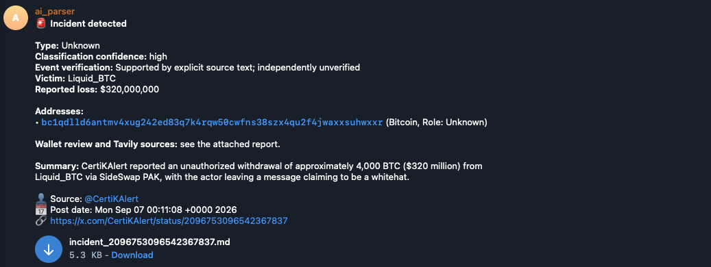
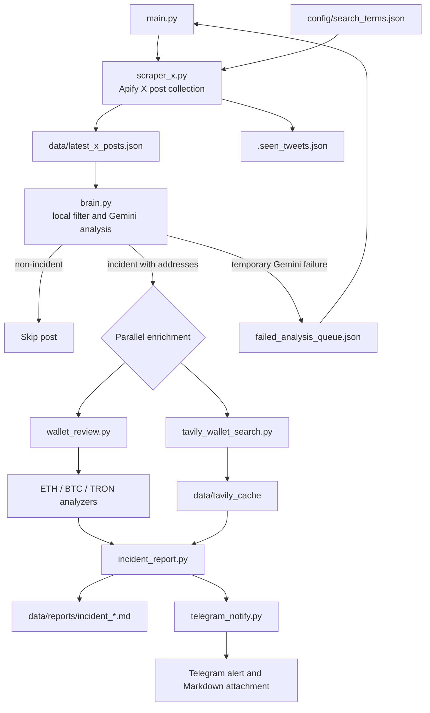

# CryptoGrapevine AI

CryptoGrapevine AI monitors X posts for cryptocurrency security incidents, classifies potential incidents with Gemini, reviews supported wallet addresses, searches public sources with Tavily, and sends a Telegram alert with a Markdown report.

This experimental project supports first-pass triage of cryptocurrency incident reports in my investigative workflow. I designed the review process, integrated the data sources and notification flow, defined validation rules, and tested the resulting reports. AI-assisted development was used to accelerate implementation and iteration.

## Examples

The [`examples/`](examples/) directory contains a complete sample incident:

- [Markdown incident report](examples/incident_2096753096542367837.md)
- [Telegram alert screenshot](examples/incident_2096753096542367837.png)



## Pipeline overview



`scraper_x.py`, `brain.py`, `wallet_review.py`, and `tavily_wallet_search.py` can also be run independently for debugging.

## Setup

```bash
python3 -m venv venv
source venv/bin/activate
pip install -r requirements.txt
cp .env.example .env
```

Populate `.env` with your API keys and Telegram chat ID. Do not commit this file.

## Configure X search terms

Edit [`config/search_terms.json`](config/search_terms.json) to define the tracked search terms used by normal pipeline runs:

```json
{
  "search_terms": [
    "(BTC OR USDT OR ETH) (from:CertiKAlert)"
  ]
}
```

For a one-time run, override the configuration without editing the file:

```bash
python main.py --search-term "(BTC OR USDT OR ETH) (from:zachxbt)"
```

Repeat `--search-term` to pass multiple queries. Search terms are not secrets, so the default configuration is stored in Git.

## Run the pipeline

```bash
python main.py
```

The pipeline saves normalized X posts, Tavily cache entries, and incident reports under `data/`. These files are local runtime output and are excluded from Git.

## Evidence and responsibilities

The pipeline produces investigation leads, not final attribution. Each part has a distinct role:

| Component | What it does | What it does not establish |
| --- | --- | --- |
| Gemini LLM | Classifies the supplied post, extracts complete addresses, proposes an incident type and a conservative address role, and summarizes only the supplied text. | Whether the claim is true, who controls an address, ownership, intent, or on-chain facts not present in the post. |
| Python analyzers | Validate address format; retrieve available balances and transaction history; calculate first and last activity, transaction counts, flows, and other chain-specific metrics; collect public Tavily sources. | That a transaction is illicit, that an address belongs to an attacker or victim, or that a public source is authoritative. API limits can leave history incomplete. |
| Analyst | Reviews the original post and linked sources, assesses the quality of Tavily results, validates ownership and transaction relationships, checks independent on-chain evidence, and decides whether to escalate or act. | Nothing is automatically attributed or treated as confirmed without this review. |

`classification_confidence` measures how confidently Gemini classified the post as a potential incident. `event_verification` measures the support for the reported event. For example, `high` and `unverified_claim` can correctly appear together: the post may clearly describe a possible incident while the underlying claim has not been independently verified.

An address role describes its stated relationship to an event, not the verified identity of its controller. `Role: Unknown` can mean that the role itself is unclear, or that the source identifies a transactional role such as recipient without establishing who controls the address. A role such as `Attacker` is retained only when the post explicitly ties that exact address to the role; even then, it remains source attribution rather than an independently established fact.

## Free-tier limits and processing scope

The project is configured for low-cost or free API usage. Provider quotas, rate limits, and data windows can change, so the values below describe the limits enforced by this code rather than a promise of available provider capacity.

| Area | Limit or scope in this project | Effect |
| --- | --- | --- |
| X collection through Apify | `main.py` requests at most 10 posts per pipeline run. | The pipeline does not attempt to process an unlimited search result set. |
| Gemini calls | Gemini is called only when the local filter finds both a security keyword and a complete wallet address. The LLM receives the full normalized post text and author only. | Wallet analysis, Tavily sources, linked article content, and previous reports are not sent to Gemini. Gemini availability and request quotas still depend on the selected provider account. |
| Tavily search | At most 2 addresses are enriched per incident; each search returns at most 5 sources and uses `basic` depth. Results are cached for 7 days. | Popular incidents cannot consume Tavily credits for every extracted address. A direct address-only retry is made only after an empty result. |
| Ethereum review | Etherscan history retrieval stops at its 10,000-record result window. | The report still includes the current ETH balance and available first/last sent transaction timestamps, then marks the address for manual verification. |
| Bitcoin review | Detailed Blockstream history analysis is capped at 10,000 confirmed transactions. | Larger histories return a balance summary and a manual-verification notice instead of an incomplete transaction analysis. |
| TRON review | Full TRC-20 and TRX transfer retrieval is capped at 10,000 records. | Larger histories return available balances and a manual-verification notice. |

The Markdown report records these partial-result and manual-verification states. Missing data or an API limit must not be interpreted as evidence that no activity occurred.

## Run components independently

```bash
python scraper_x.py --input data/latest_x_posts.json
python brain.py --posts-file data/latest_x_posts.json --post-index 0
python wallet_review.py --address 0x... --blockchain ethereum
python tavily_wallet_search.py 0x... --no-cache
```

See `DEBUGGING.md` for further examples.

## Required environment variables

| Variable | Purpose |
| --- | --- |
| `GEMINI_API_KEY` | Gemini incident analysis |
| `APIFY_TOKEN` | X post collection through Apify |
| `ETHERSCAN_API_KEY` | Ethereum wallet review |
| `TELEGRAM_BOT_TOKEN` | Telegram alert delivery |
| `TELEGRAM_CHAT_ID` | Destination Telegram chat |
| `TAVILY_API_KEY` | Public-web source enrichment |
